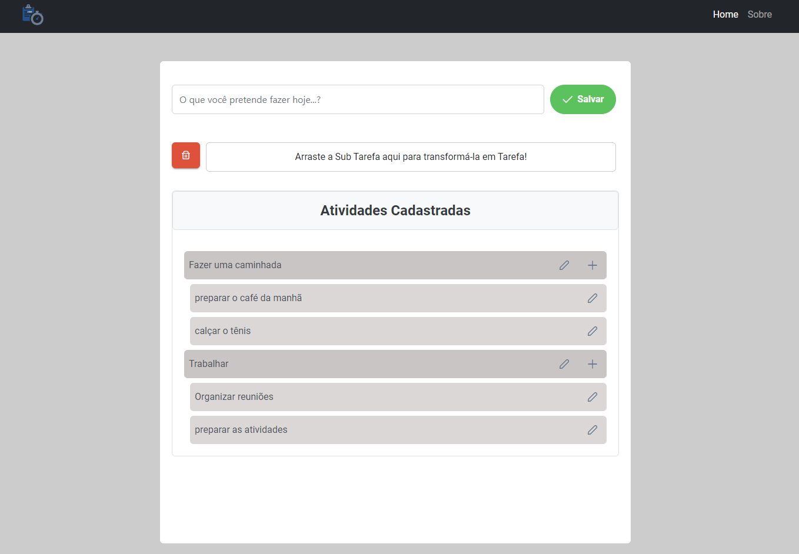

<h1 align="center">
  Gerenciador de Tarefas Online 📋
</h1>

<h4 align="center">
  Quais as suas tarefas diárias? 💬
</h4>

  <a href="#computer-projeto">Projeto</a>&nbsp;&nbsp;&nbsp;|&nbsp;&nbsp;&nbsp;
  <a href="#date-avaliação-do-escopo">Avaliação do escopo</a>&nbsp;&nbsp;&nbsp;|&nbsp;&nbsp;&nbsp;
  <a href="#alarm_clock-estimativas">Estimativas</a>&nbsp;&nbsp;&nbsp;|&nbsp;&nbsp;&nbsp;
  <a href="#ghost-tecnologias">Tecnologias</a>&nbsp;&nbsp;&nbsp;|&nbsp;&nbsp;&nbsp;
  <a href="#rocket-iniciando-aplicação">Iniciando aplicação</a>&nbsp;&nbsp;&nbsp;|&nbsp;&nbsp;&nbsp;
  <a href="#computer-web">Web</a>

 

  

## :computer: Projeto

o Gerenciador de Tarefas é uma ferramenta online disponível para seus usuários para organização das suas tarefas diárias.

## :date: Avaliação do escopo

Não tive dúvidas relacionado ao escopo.

## :alarm_clock: Estimativas

- Com início de desenvolvimento em 05/05/2023, o projeto será entregue até dia 07/05/2023.

- :art: Frontend e Backend

- [x] Avaliação do escopo e analise para estimativas `1,0h`
- [x] Criação inicial do projeto e ambiente `1,0h`
- [x] Tela Dashboard `2,0h`
- [x] Tela Sobre `0,5h`
- [x] CRUD Tarefa
  - [x] Criar uma Tarefa `1h` x
  - [x] Editar uma Tarefa existente `1h`
  - [x] Apagar uma Tarefa existente `1h`
  - [x] Organizar a Tarefa como subTarefa de uma tarefa existente `6,0h`
- [x] CRUD SubTarefa
  - [x] Criar uma subtarefa `1h`
  - [x] Editar uma subtarefa existente `1h`
  - [x] Apagar uma subtarefa existente `1h`
  - [x] Atualizar status de uma subtarefa existente `2h`
  - [x] Mover uma subtarefa de uma subtarefa pai X para outra subtarefa pai Y `4,0h`
  - [x] Mover uma subtarefa para fora da subtarefa pai, transformando-o em um outra subtarefa pai `2,0h`
- [x] Compartilhar TODO `1,0h`
  - [x] Como usuário gostaria de compartilhar a URL do ToDo que estou editando por email para uma ou mais pessoas `2h`
- [X] Testes `2,0h`

Total: 29,5 Horas

## :ghost: Tecnologias

Esse projeto foi desenvolvido com as seguintes tecnologias:

- [Angular](https://angular.io/)
- [Java](https://www.java.com/pt-BR/)
- [Postgres](https://www.postgresql.org/)

## :rocket: Iniciando aplicação

- Clone este repositório usando `git clone http://git.vibbra.com.br/davi-1624633177/management-task-api.git`;
- Mova-se para diretório da aplicação: `cd management-task-api`;
- Execute `yarn install` ou `npm install` para instalar as dependências no front;
- Verifique no arquivo properties.yaml as configurações de banco necessárias;
- Execute o projeto backend java em alguma IDE;

## :computer: Web

- Aplicação web disponível em: <a href="https://github.com/daviht7/management-task-api">Frontend</a>
- Aplicação web disponível em: <a href="https://github.com/daviht7/management-task-app">Backend</a>

---

### <a href="https://www.linkedin.com/in/daviht7/">LinkedIn</a>